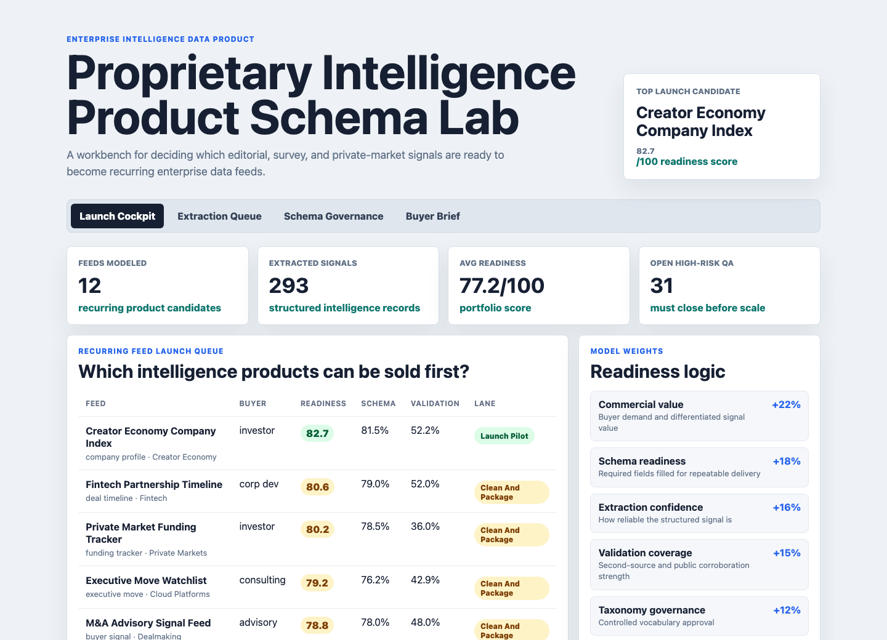
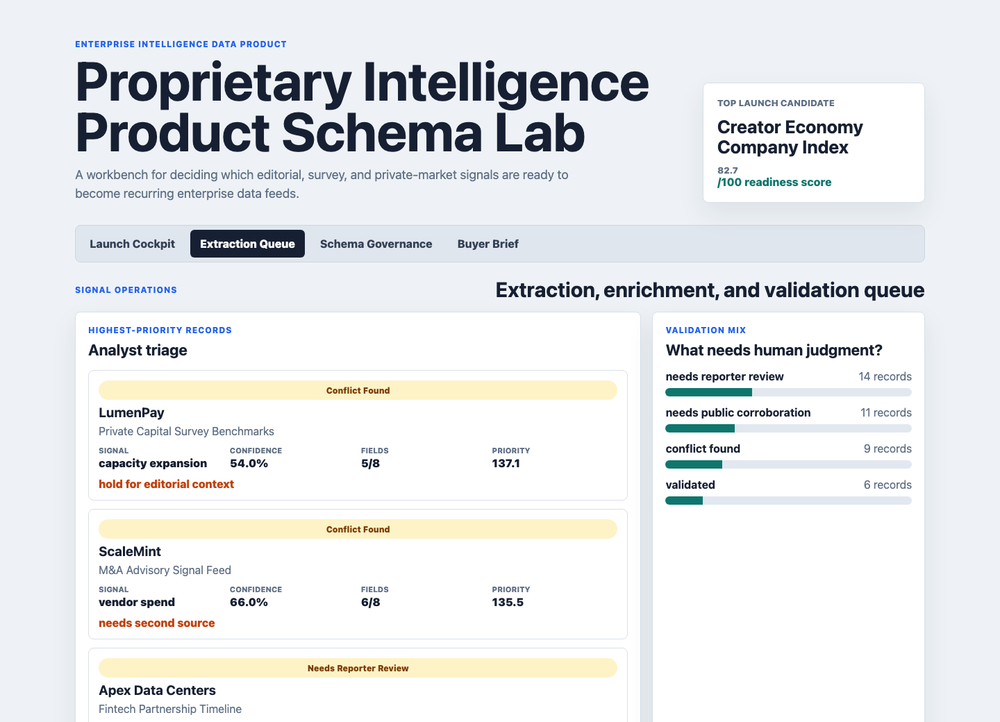
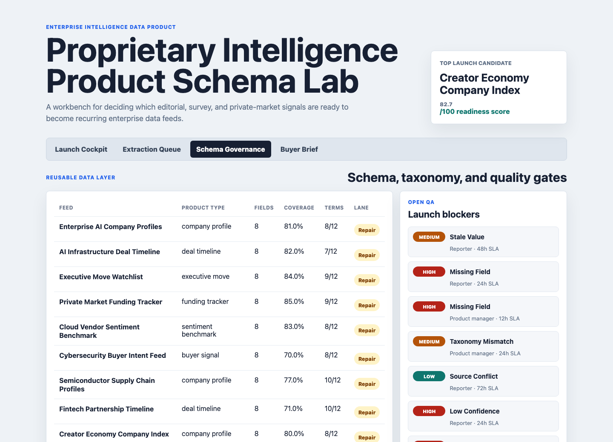
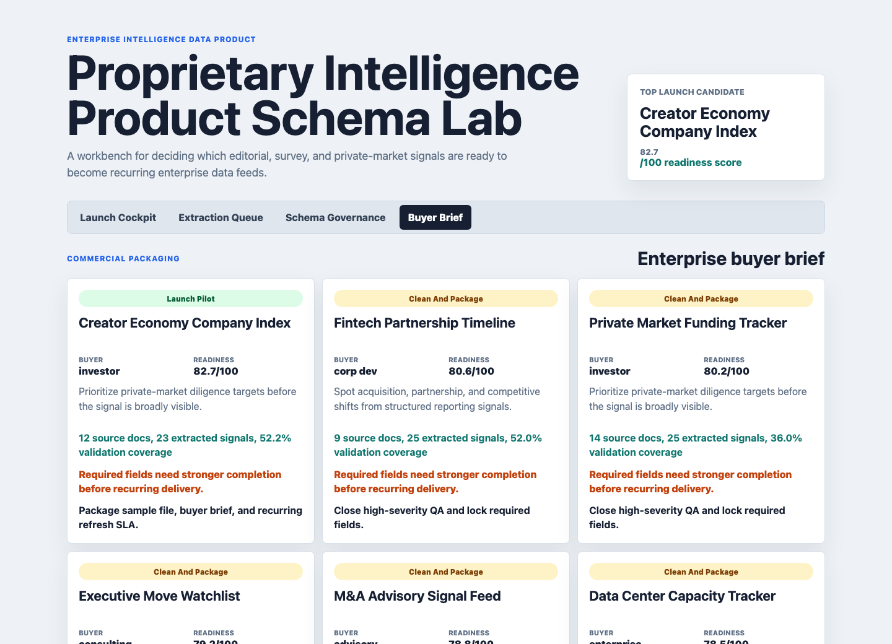

# Proprietary Intelligence Product Schema Lab

An interactive portfolio artifact for a subscription intelligence newsroom building enterprise data products from original reporting, subscriber surveys, executive moves, private-company research, funding signals, and public-source corroboration.

The project answers one operating question: which proprietary signals are ready to become a recurring enterprise intelligence feed, and what schema, taxonomy, validation, and enrichment work must happen before launch?

## Screenshots



**Feed launch cockpit:** ranks recurring data feed candidates by buyer fit, commercial value, schema readiness, extraction confidence, validation coverage, taxonomy governance, survey strength, source depth, and QA risk.



**Extraction and enrichment queue:** shows record-level signals that need analyst review, including company, signal type, validation status, confidence, schema field completion, triage priority, and next action.



**Schema governance surface:** tracks required fields, field coverage, taxonomy approvals, definition gaps, ownership, and open QA items that would block recurring client delivery.



**Enterprise buyer brief:** converts the internal readiness model into client-facing product recommendations, proof points, launch blockers, and packaging actions.

## What This Demonstrates

- Structuring messy editorial intelligence into company profiles, deal timelines, executive move records, sentiment benchmarks, buyer-intent feeds, and funding trackers.
- Building a reusable taxonomy and schema layer so intelligence can be searched, compared, refreshed, and sold as enterprise data.
- Applying research rigor through extraction confidence, validation coverage, public corroboration counts, source conflicts, and owner-based QA checks.
- Thinking like a data product analyst: every feed has a buyer, a commercial use case, a launch lane, blockers, and a recommended next step.
- Using AI-style extraction logic responsibly. The model treats extraction confidence as one input, then requires human validation and source review before launch.

## Data Strategy

All data is synthetic and generated by `scripts/score_operating_data.py` with a fixed random seed. It does not represent any real company, newsroom, customer, subscriber, source, or commercial performance.

The synthetic structure is modeled on common subscription intelligence product patterns:

- Original reporting and reporter notes become source documents with exclusivity level, desk, source type, buyer relevance, and extraction complexity.
- Private-company intelligence becomes profile records with stage, sector, headcount band, valuation band, proprietary signal count, and public corroboration count.
- Productized facts become extracted signals with target product, required schema fields, fields filled, validation status, extraction confidence, buyer use case, and commercial value.
- Survey research becomes audience-segment sentiment benchmarks with sample size, positive share, negative share, trend delta, and recurring feed fit.
- Data governance becomes taxonomy terms, field coverage, approval status, QA severity, SLA, and resolution owner.

Generated source files:

| File | Purpose |
|---|---|
| `data/source_documents.csv` | Synthetic reporting, survey, filing, funding database, note, and briefing sources. |
| `data/company_profiles.csv` | Synthetic private-company enrichment layer. |
| `data/extracted_signals.csv` | Structured facts mapped to product schemas. |
| `data/taxonomy_terms.csv` | Controlled vocabulary and governance metadata. |
| `data/survey_sentiment.csv` | Recurring subscriber-style survey benchmarks. |
| `data/quality_checks.csv` | Validation, source conflict, taxonomy, and confidence checks. |

## Analysis Outputs

| Output | Purpose |
|---|---|
| `analysis/outputs/feed_launch_queue.csv` | Ranked readiness queue for recurring enterprise feeds. |
| `analysis/outputs/extraction_enrichment_queue.csv` | Analyst work queue for validation and schema completion. |
| `analysis/outputs/schema_governance_queue.csv` | Schema and taxonomy readiness by feed. |
| `analysis/outputs/client_brief.csv` | Buyer-facing launch rationale, blockers, and recommendations. |
| `analysis/sql_checks.sql` | SQL patterns for feed readiness, extraction QA, and taxonomy gaps. |
| `analysis/executive_findings.md` | Short written findings for interview discussion. |

## Readiness Model

The feed readiness score is intentionally transparent and rules-based:

- Commercial value: 22%
- Schema readiness: 18%
- Extraction confidence: 16%
- Validation coverage: 15%
- Taxonomy governance: 12%
- Survey strength: 10%
- Source depth: 7%
- QA risk: subtracts up to 12%

This design keeps the artifact defensible. A candidate can explain why a feed is pilot-ready, why another needs cleanup, and where human editorial judgment still matters.

## Run Locally

```bash
npm install
npm run analyze
npm start
```

Open `http://localhost:5973`.

To refresh screenshots after the server is running:

```bash
npm run screenshots
```

## Scope

This is a static portfolio artifact with reproducible synthetic data and transparent scoring. It does not connect to a live newsroom CMS, survey platform, filings database, CRM, subscription system, data warehouse, or client delivery API. It does show how an analyst can convert proprietary, semi-structured intelligence into schema-ready, QA-gated, commercially packaged data products.
